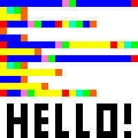

# Dissertation Esolang Project

## About

This project is the code written for my final year dissertation project. The dissertation was on the topic of esoteric languages or esolangs (joke languages), and how they can lead to a lot of creativity and potentially even real world uses. For part of this I wrote my own language spec, and created a simple interpreter in Python to run programs written in it. The language is based on two of the most famous esolangs, Piet, an image based language, and Brainfuck, a language with only a few simple commands which operate on a collection of memory. 

This language is named Visual Brainfuck, and is an image based language with a small number of commands which are executed based on coloured pixels in the image source. The spec is not included in this repo as it was part of the dissertation paper, however the commands and colours used in programs can be easily determined by reading the function commandCheck.

## How to use

### Prerequisites

- Python 3 (Developed on Python 3.10)
- The [Pillow image processing library](https://pypi.org/project/Pillow/)

### Usage

Run a program:
> python main.py [programName.png]

Check other command line arguments:
> python main.py -h